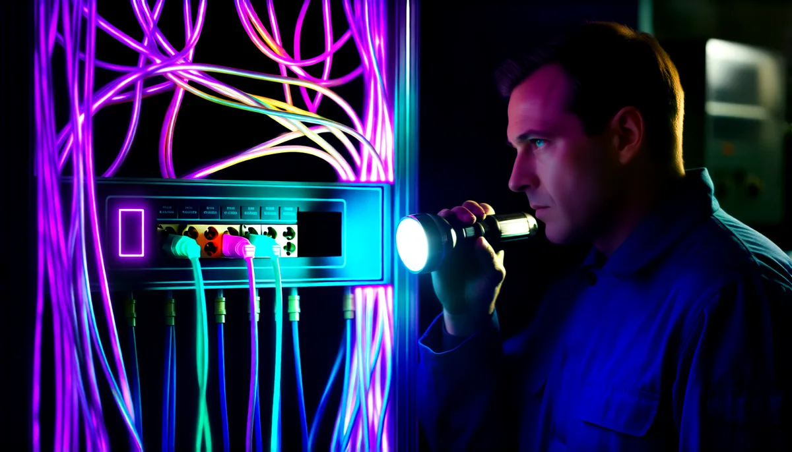

# comfy-mcp-fixes



Agent skill: fixes for ComfyUI custom-node UIs that won't show, restart_comfyui no_background_server, and comfy-cli servers that block Desktop updates.

An agent skill from [VIOLINET Tech](https://github.com/Violinet-tech). It is a folder with a `SKILL.md`, written from a real job and the mistakes made on the way. It works in Claude Code and any harness that reads the `SKILL.md` format, and the markdown is readable as plain docs without an agent.

Page: https://violinet-tech.github.io/comfy-mcp-fixes/

## Use it when

a ComfyUI custom node's widget or overlay is missing or empty, `restart_comfyui` fails with `no_background_server`, or a comfy-cli server blocks ComfyUI Desktop from updating.

## Install

Clone it into your skills folder. The folder name must match the `name:` in `SKILL.md`, which is why it is cloned under that name:

```bash
git clone https://github.com/Violinet-tech/comfy-mcp-fixes ~/.claude/skills/comfy-mcp-fixes
```

For one project only, clone into `.claude/skills/comfy-mcp-fixes` instead.

## What's inside

- `SKILL.md`: the skill

## More skills

See [all VIOLINET Tech skills](https://github.com/orgs/Violinet-tech/repositories?q=topic%3Aagent-skills).

## Contributing

Issues and PRs welcome. Keep it generic: no personal paths, keys or machine addresses.

## License

MIT, see [LICENSE](LICENSE).
